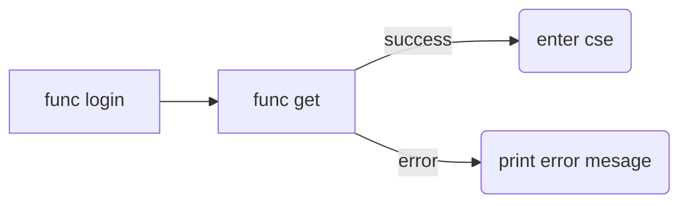

IOT Final - Security Enhancement
==========

## Feature
1. Information Leak Defense
   - Problem : When use http, the packet content will be leaked
      
   - Solution : Enable HTTPS to encrypt packet content
3. Brute Attack Defense
   - Problem : Attacker can guess the password endlessly until cracks it
   - Solution : Block user after 5 failed login attempts

## Initialization
1. Clone this project
2. Re-build the project
   ```sh
   $ mvn clean install -DskipTests=true
   ```
3. Install wireshark and start wireshark
   ```sh
   # Install wireshark
   $ sudo apt install wireshark

   # Start wireshark
   $ sudo wireshark
   ```

## Information Leak Defense : Enable HTTPS to encrypt packet content
### Step 1 : Generate a self-signed certificate using java keytools
1. Create a folder to place generated certicates and enter the folder
   ```sh
   $ mkdir ~/.SSLCA
   $ cd ~/.SSLCA
   ```
2. Generate a self-signed certificate for in-cse
   * Set password to '000000'
   ```sh
   $ keytool -genkey -dname "CN=127.0.0.1" -alias INCSE -keystore .keystore_incse -keyalg RSA -keysize 1024
   ```
3. Generate a self-signed certificate for mn-cse
   * Set password to '000000'
   ```sh
   $ keytool -genkey -dname "CN=127.0.0.1" -alias MNCSE -keystore .keystore_mncse -keyalg RSA -keysize 1024
   ```
 
4. The result will like below <br>
   
   
### Step 2 : Modify 'config.ini' of in-cse and mn-cse
1. Append the following code to the bottom of "config.ini" of in-cse
   * Enable HTTPS
   * Set HTTPS port to 8443
   * certificate password : 000000
   * Set the path of certificate : /home/[user_name]/.SSLCA/.keystore_incse
   * Use TLS protocal
   ```c
   org.eclipse.equinox.http.jetty.https.enabled=true
   org.eclipse.equinox.http.jetty.https.port=8443
   org.eclipse.equinox.http.jetty.ssl.password=000000
   org.eclipse.equinox.http.jetty.ssl.keypassword=000000
   org.eclipse.equinox.http.jetty.ssl.keystore=/home/om2m/.SSLCA/.keystore_incse
   org.eclipse.equinox.http.jetty.ssl.protocol=TLS
   ```
   
3. Append the following code to the bottom of "config.ini" of mn-cse
   * Enable HTTPS
   * Set HTTPS port to 8444
   * certificate password : 000000
   * Set the path of certificate : /home/[user_name]/.SSLCA/.keystore_mncse
   * Use TLS protocal
   ```c
   org.eclipse.equinox.http.jetty.https.enabled=true
   org.eclipse.equinox.http.jetty.https.port=8444
   org.eclipse.equinox.http.jetty.ssl.password=000000
   org.eclipse.equinox.http.jetty.ssl.keypassword=000000
   org.eclipse.equinox.http.jetty.ssl.keystore=/home/om2m/.SSLCA/.keystore_mncse
   org.eclipse.equinox.http.jetty.ssl.protocol=TLS
   ```
### Step 3 : Test
1. Start in-cse and mn-cse
   ```sh
   $ sh start.sh
   ```
   
2. Open browser and enter 'https://127.0.0.1:8443/webpage' for in-cse <br>
   
   
3. Open browser and enter 'https://127.0.0.1:8444/webpage' for mn-cse <br>
   
   
4. mn-cse can be linked from in-cse
   

5. Use wireshark to check whether the packet is encrypted after enabling https
   


## Brute Attack Defense : Block user after 5 failed login attempts
Work at `org.eclipse.om2m/org.eclipse.om2m.webapp.resourcesbrowser.json/`
### Step 1 : Add a new block in ‘index.html’ to display fail counts
* Add a `failCount` div in the login page <br>
  
  
* Result <br>
  
  
### Step 2 : Modify ‘om2m.js’ to accumulate fail counts and block user when fail counts > 5


1. Declare 3 additional variables and const
   * const tryCountMax : Maximum number of failed login attempts allowed for a user
   * var tryCount : Cumulative number of failed attempts
   * var isBlocked : If true, the user is banned
   <br>
   
   <br>
   
2. Modify `func login`
   * This function is triggered when user try to login
     * It collects the username:password pair and calls "func get" to determine if the pair is legal
   * I use isBlocked to determine if the user has permission to log in
   <br>
   
   <br>

3. Modify `func get`
   * `func get` has 2 parts (success and error)
     <br>
     
     <br>
     
   * I modify the error part
     * Cumulate the fail count
     * Set isBlocked when fail count >= 5
     * print error message
     <br>
     
     <br>
     
### Step 3 : Test
Successfully ban the user with more than 5 failed login attempts
<br>


   
